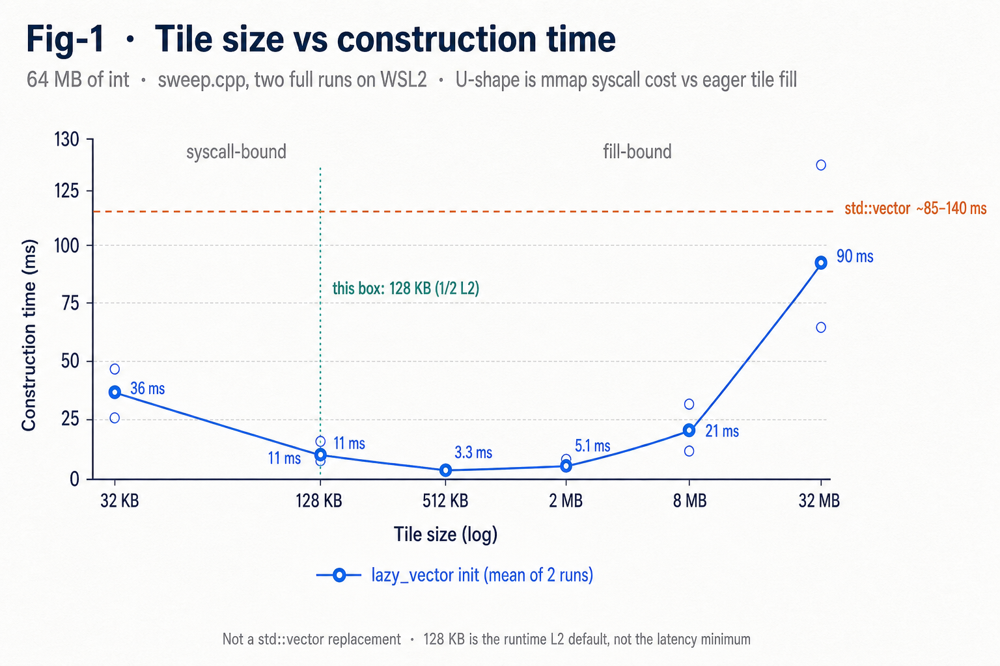
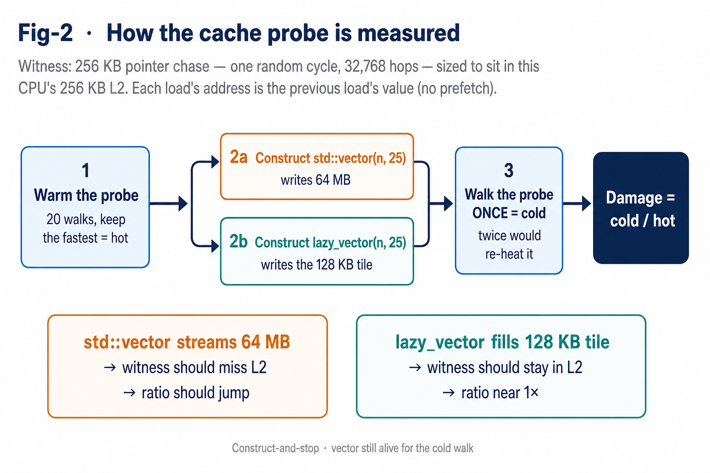

# lazy_vector

**Not all dynamic memory allocations are equal.**

A Linux-only proof of concept: a `vector`-shaped container that makes `vector<int>(n, 25)` as lazy as `vector<int>(n, 0)`, using copy-on-write and a `memfd` tile.

Not a `std::vector` replacement. A demonstration that *allocate* and *initialize* do not have to be the same operation.

---

## The observation

While studying dynamic allocation — `brk` vs `mmap` — I noticed that

```cpp
vector<int>(n, 0);
```

is cheaper than

```cpp
vector<int>(n, 25);
```

in both latency and cache thrashing.

Anonymous `mmap` (`MAP_ANONYMOUS`) reserves address space that must be zeroed, because the physical frames may still hold another process's data. Then `vector<int>(n, 25)` walks the buffer and writes `25` into every slot. That is a second write over the same pages, and extra cache footprint, for a vector that may not even be used soon.

The latency is not a clean 2× memory cost. The kernel's zero and the constructor's fill hit the *same* cache lines. What you waste is store traffic — and cache occupancy if the initialized vector sits unused.

I got curious how far that "zero is free" trick could be generalized. Can you make `vector<int>(n, 25)` as lazy as `vector<int>(n, 0)`?

It turns out you can. It also turns out the win is not where I expected, the thing I set out to eliminate was never the real cost, and one of my measurements is pure chaos. Great way to spend the Labour Day weekend, I guess.

---


## The trick

Three steps:

1. Create a `memfd` (an anonymous, RAM-backed file) and fill **one** small tile with the repeating value — say 512 KB of `25`, or any trivially copyable pattern.
2. Reserve the full address range you need.
3. Map that same tile `MAP_PRIVATE` over the whole range, repeatedly.

Rather than eagerly initializing a contiguous physical range, every page of the vector aliases the same tile. Only the tile is physically mapped and filled in cache. Reads are free. A write copy-on-write-faults a private page whose source is already the pattern, so the constructor never has to fill the whole buffer.

Tile size is chosen at runtime, not hardcoded. The constructor reads L2 via `sysconf` and takes a fraction of it (default half), then rounds up to a legal multiple of `lcm(sizeof(T), page)`. On this box that is 128 KB. Syscall count falls out of the cache budget. Pass a fraction.

---


## Results

64 MB of `int`, construct-and-stop. No consumer loop. The vector is still alive for the second measurement.


|                                 | `std::vector` | `lazy_vector`      |
| ------------------------------- | ------------- | ------------------ |
| Construction                    | ~85 ms        | **~3 ms** (~30×)   |
| Physical memory at construction | 64 MB         | **128 KB** (~512×) |
| Page faults during construction | 16389         | **32**             |


Construction is a stopwatch. Start the clock, call the constructor, stop the clock. On this machine that is ~90 ms for `std::vector` and ~3 ms for `lazy_vector` with a 128 KB tile. That number is loud enough to survive WSL2 jitter.

### Tile size has a real optimum

Too small and you drown in `mmap` syscalls. Too large and the eager fill you were avoiding comes back. Sweeping tile size produces a U-curve.



*Fig 1 · Construction time vs tile size on 64 MB of* `int`*. Mean of two WSL2 runs. The dashed orange line is* `std::vector`*. The green line is this machine's runtime default: half of L2.*

Modelling init as `a·t + b·N/t` predicts `t* = sqrt(bN/a) ≈ 1.3 MB`. The measured minimum sat around 512 KB–2 MB. The useful part: `t*` grows as `sqrt(N)`, so the eager fill is `O(sqrt(N))` while the baseline is `O(N)` — it can never dominate.

The latency-optimal tile is larger than half of L2. The constructor still caps at the cache budget, because the tile *is* the cache budget.

---


## The honest half

**Dense writes are a wash.** If you write every page immediately, you materialize all 64 MB anyway, and a copy-on-write fault is *more* expensive than a plain one (`copy_page` reads and writes 4 KB; `clear_page` only writes). Total time comes out about even, if not worse.

Cache damage is the claim I could not prove. The numbers above are from a clean construct-and-stop. How I measured them — and the places the measurement lied — is below.

---


## Measuring cache damage

I wanted two questions, for a 64 MB `vector<int>(n, 25)` versus `lazy_vector`:

1. How long does construction take?
2. How much of the CPU's cache does that construction destroy?

Construction is a stopwatch. Cache has to be inferred. I cannot read "was line X in L2" from userspace. So I planted a witness.



*Fig 2 · The witness is a 256 KB pointer chase sized to sit in this CPU's 256 KB L2. 32,768 hops, one random cycle, so the prefetcher cannot hide a miss. Damage is the ratio of one cold walk after construction to the fastest hot walk before it.*

The prediction:

- `std::vector` writes 64 MB and should evict the witness. Ratio jumps.
- `lazy_vector` writes a 128 KB tile and should leave the witness almost untouched. Ratio near 1×.

A sequential scan would have shown maybe 20%. Latency should have shown 5–15× if the probe fell out of L2 entirely.

### What actually happened

Init time is a real win. Construction is about 30× faster, and the only bytes `lazy_vector` eagerly writes are the tile.

The probe did not say the rest. Hot time — the half that is supposed to be stable — jumped around inside a single run. Cold/hot for `std::vector` came back 1.5× in one run and 3.6× in the next. `lazy_vector` sometimes looked *worse* than the baseline, sometimes identical. The ratio does not track tile size, does not track init time, and does not repeat.

I am doing this on WSL2, but I cannot just chalk it up to that.

### The actual question

How do you debug what the cache is doing from userspace when the only instrument you have is "this array got slower"? What would you even read to find out whether the probe is still in L2, whether it was the fill that evicted it, or whether the VM just scheduled you off the core for 200 µs?

I want to know what the cache was actually doing while the probe lied.

---


## Constraints

- `T` must be **trivially copyable**. Elements are materialized by copying raw bytes.
- Data must be **position-independent**. Self-referential pointers break across remapped tiles.
- Linux only. `memfd_create` needs WSL2, not WSL1.
- Copy and move are deleted. The type owns a mapping and a file descriptor.
- Not a growth container. `resize` / `push_back` would invalidate the mapping.

---


## Build

```bash
g++ -O2 -std=c++20 bench.cpp -o bench && ./bench
```

`bench.cpp` times construction, reports RSS, and runs the cache probe against both `std::vector` and `lazy_vector`.